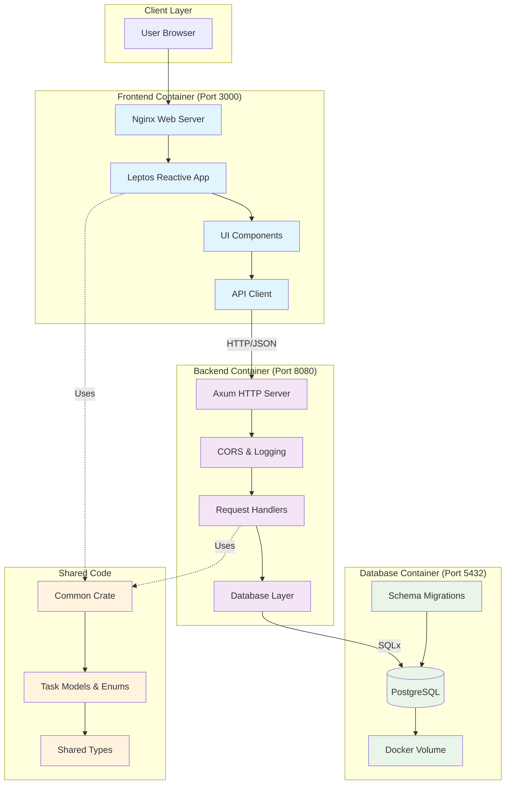

# RustTracker

RustTracker is a full-stack task management web application built entirely in Rust. It features a fast backend using Axum, a reactive frontend using Leptos, and a PostgreSQL database. The entire project is containerized using Docker and Docker Compose for easy setup and deployment.

## Table of Contents

- [Key Features](#key-features)
- [Requirements](#requirements)
- [Getting Started](#getting-started)
  - [Quick Setup](#quick-setup)
- [Tech Stack](#tech-stack)
- [Project Structure](#project-structure)
- [Architecture Overview](#architecture-overview)
- [API Endpoints](#api-endpoints)
- [Running Tests](#running-tests)
- [Environment Configuration](#environment-configuration)
- [Volumes and Persistence](#volumes-and-persistence)
- [Local Development](#local-development)
- [TODO](#todo)
- [Contributing](#contributing)
- [License](#license)

## Key Features

- **Full-stack Rust** - Single language across the entire stack
- **Reactive UI** - Real-time updates with [Leptos signals](https://leptos.dev/)
- **Type Safety** - Shared models between frontend and backend
- **Containerized** - Complete [Docker](https://www.docker.com/) setup
- **Production Ready** - Health checks, logging, error handling
- **Comprehensive Testing** - 88 tests with comprehensive coverage
- **Performance Benchmarks** - Performance testing and optimization
- **Security Audited** - Vulnerability scanning and dependency checks

## Requirements

- [Docker](https://docs.docker.com/get-docker/)
- [Docker Compose](https://docs.docker.com/compose/install/)

No need to install [Rust](https://rustup.rs/), [PostgreSQL](https://www.postgresql.org/), or frontend tooling locally.

## Getting Started

RustTracker uses a Makefile for development. All commands should use the Makefile targets for consistency.

### Quick Setup

1. Clone the repository:

```bash
git clone <repository-url>
cd rust-tracker
```

1. Run the setup script:

```bash
make setup
```

This will build and start all services with health checks.

1. Use stop to stop services or clean to clean up after:

```bash
make stop # Stops all services
make clean # Stop services and clean up
```

### Makefile Commands

```bash
make setup       # Initial setup - builds and starts all services
make build       # Build all Docker images
make start       # Start all services
make stop        # Stop all services
make restart     # Restart all services
make rebuild     # Rebuild and start all services
make status      # Show service status
make logs        # View logs for all services
make clean       # Stop services and clean up
make db          # Connect to database shell
make test        # Run comprehensive test suite (56 backend tests + 32 frontend logic tests)
make quick-test  # Run quick test suite (common crate only)
```

## Tech Stack

- **Language**: [Rust](https://www.rust-lang.org/) (Full-stack single language)
- **Backend**: [Axum framework](https://github.com/tokio-rs/axum) + [SQLx](https://github.com/launchbadge/sqlx) + [PostgreSQL](https://www.postgresql.org/)
- **Frontend**: [Leptos framework](https://leptos.dev/) + [Tailwind CSS](https://tailwindcss.com/)
- **Database**: [PostgreSQL](https://www.postgresql.org/) with custom enum types
- **Containerization**: [Docker](https://www.docker.com/) + [Docker Compose](https://docs.docker.com/compose/)
- **Build System**: [Cargo workspaces](https://doc.rust-lang.org/book/ch14-03-cargo-workspaces.html)
- **Web Server**: [Nginx](https://nginx.org/) (for frontend static files)
- **Testing**: Comprehensive test suite with 88 tests
  - Unit tests, integration tests, performance benchmarks
  - Backend tests: 56 tests passing with database isolation
  - Frontend tests: 32 logic tests covering API and validation
  - Database isolation with [serial_test](https://crates.io/crates/serial_test)
- **Development Tools**: Custom scripts and Makefile

## Project Structure

```text
rust-tracker/
├── README.md                    # Project documentation
├── Cargo.toml                  # Workspace configuration
├── Makefile                     # Development shortcuts
├── .env                         # Environment variables
├── docker/                      # Docker configuration
│   ├── docker-compose.yml         # Container orchestration  
│   ├── docker-compose.test.yml    # Test environment
│   ├── Dockerfile.test            # Testing container
│   ├── Dockerfile.backend         # Backend container definition
│   └── Dockerfile.frontend        # Frontend container definition
├── backend/                     # Axum REST API
│   ├── src/
│   │   ├── main.rs                 # Server entry point
│   │   ├── handlers.rs             # HTTP request handlers
│   │   ├── database.rs             # Database operations
│   │   ├── error.rs                # Error handling
│   │   ├── auth.rs                 # Authentication logic
│   │   ├── rate_limit.rs           # Rate limiting middleware
│   │   └── tests/                  # Comprehensive test suite
│   │       ├── mod.rs              # Test module exports
│   │       ├── database_tests.rs   # Database layer tests (23 tests)
│   │       ├── handler_tests.rs    # HTTP handler tests (20 tests)
│   │       ├── error_tests.rs      # Error handling tests (8 tests)
│   │       ├── integration_tests.rs # Integration tests (6 tests)
│   │       └── benchmarks.rs       # Performance benchmarks (8 tests)
│   ├── migrations/             # Database schema
│   │   └── 001_initial.sql         # Initial database setup
├── frontend/                    # Leptos reactive app
│   ├── src/
│   │   ├── lib.rs                  # App entry point
│   │   ├── api.rs                  # HTTP client
│   │   ├── tests/                  # Frontend test suite
│   │   │   ├── mod.rs              # Test module exports
│   │   │   └── logic_tests.rs      # Logic tests (32 tests)
│   │   ├── components/             # UI components
│   │   │   ├── header.rs           # Application header
│   │   │   ├── task_form.rs        # Task creation/editing form
│   │   │   ├── task_item.rs        # Individual task display
│   │   │   ├── task_list.rs        # Task list container
│   │   │   ├── modal.rs            # Modal dialog components
│   │   │   └── mod.rs              # Component exports
│   │   └── pages/                  # App pages
│   │       ├── home.rs             # Main task management page
│   │       └── mod.rs              # Page exports
│   ├── index.html               # HTML entry point
│   ├── nginx.conf               # Web server config
├── common/                      # Shared types
│   └── src/
│       ├── lib.rs                  # Data models and enums
│       └── tests/                  # Common crate test suite
│           ├── mod.rs              # Test module exports
│           └── data_structures.rs  # Data structure tests (19 tests)
└── scripts/                       # Development tools
    ├── frontend_build_production.sh  # Frontend production build script
    ├── frontend_dev_server.sh        # Frontend development server
    ├── run_quick_tests.sh            # Quick test runner
    └── run_comprehensive_tests.sh    # Comprehensive test runner
```

## Architecture Overview



## API Endpoints

Standard REST API for task management:

- `GET /api/tasks` - List all tasks (supports filtering)
  - `?status=Todo|InProgress|Completed`
  - `?priority=Low|Medium|High|Urgent`
  - `?due_before=2024-12-31T23:59:59Z`
  - `?due_after=2024-01-01T00:00:00Z`
- `POST /api/tasks` - Create new task
- `PUT /api/tasks/:id` - Update existing task
- `DELETE /api/tasks/:id` - Delete task
- `GET /health` - Health check endpoint

All endpoints use JSON format and the Task model from the `common` crate. The API includes proper error handling, CORS support, and structured logging.

## Running Tests

```bash
make test          # Run comprehensive test suite (56 backend tests + 32 frontend logic tests)
make quick-test    # Run quick test suite (common crate only)
```

### Frontend Testing

The project includes **frontend logic tests** that don't require a browser:

- **Logic Tests** (`frontend/src/tests/logic_tests.rs`)
  - Standard Rust tests that don't require browser
  - Test business logic, data validation, and API client logic
  - Included in `make test` (32 tests)
  - Run in CI/CD pipeline

The logic tests cover:

- API URL generation and query parameters
- Request/response data validation
- Error handling and edge cases
- Component state management
- Data formatting and serialization

## Environment Configuration

### Security Notice

**Never commit `.env` files to version control!** The repository includes a `.env.example` template for setup.

Create your local `.env` file:

```bash
# Copy the template
cp .env.example .env

# Edit with your actual values
nano .env
```

Example configuration (edit with your values):

```env
DATABASE_URL=postgres://postgres:password@db:5432/rusttracker
RUST_LOG=info
ENVIRONMENT=development
```

### Environment Variables

- `DATABASE_URL`: PostgreSQL connection string
- `RUST_LOG`: Logging level (debug, info, warn, error)
- `ENVIRONMENT`: Environment mode (development, staging, production)

For production deployment and CI/CD security practices, see the [TODO](#todo) section for planned enhancements.

## Volumes and Persistence

PostgreSQL data is stored in a Docker volume defined in `docker/docker-compose.yml`.

To remove containers and volumes:

```bash
docker compose down -v
```

## Local Development

The project is designed to run with Docker using Makefile commands:

```bash
make setup      # Initial setup
make start      # Start services
make logs       # View logs
make quick-test # Run quick tests
```

## TODO

- [x] **Make test command**: `make test` implemented - comprehensive test suite runner (56 backend tests + 32 frontend logic tests)
- [x] **Frontend logic testing**: Frontend logic tests integrated into main test suite (no browser required)
- [ ] **Backend shell improvements**: `make backend-shell` lacks proper debugging tools
- [ ] **Makefile organization**: Available commands need consolidation and documentation
- [ ] **Performance optimization**: Consider implementing cargo workspace caching for faster builds
- [ ] **Rate limiting**: Document and enhance rate limiting configuration (basic implementation exists)
- [ ] **Authentication system**: Enhance JWT-based user authentication and authorization (basic implementation exists)
- [ ] **Real-time updates**: WebSocket support for live task synchronization
- [ ] **Advanced filtering**: Full-text search and custom filter combinations
- [ ] **Bulk operations**: Multi-task selection and batch processing
- [ ] **API versioning**: Implement proper API versioning strategy
- [ ] **Property-based testing**: Implement QuickCheck for data structure validation
- [ ] **Mutation testing**: Add mutation testing for test quality validation
- [ ] **Load testing**: Implement realistic user scenario testing
- [ ] **Accessibility testing**: Frontend component accessibility validation
- [ ] **API documentation**: Generate OpenAPI/Swagger documentation
- [ ] **Architecture diagrams**: Update mermaid diagrams for new features
- [ ] **Performance benchmarks**: Document detailed performance metrics
- [ ] **Deployment guide**: Production deployment and scaling documentation

## Contributing

1. Fork the repository
2. Create a feature branch
3. Make your changes
4. Add tests for new functionality
5. Ensure all tests pass: `make quick-test`
6. Run quality checks: `cargo clippy && cargo fmt`
7. Submit a pull request

### Development Guidelines

- Follow [Rust naming conventions](https://rust-lang.github.io/api-guidelines/naming.html)
- Add tests for all new features
- Update documentation for API changes
- Ensure Docker builds succeed
- Maintain good test coverage

See [Getting Started](#getting-started) for detailed setup instructions.

## License

[MIT License](LICENSE) - see LICENSE file for details.
