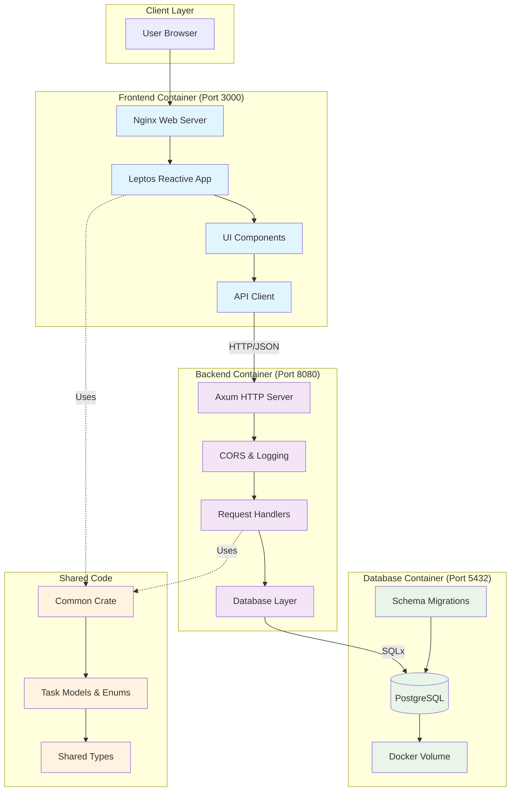

# RustTracker

RustTracker is a full-stack task management web application built entirely in Rust with a simplified, modern architecture. It features a fast backend using Axum, a reactive frontend using Leptos, and a PostgreSQL database. The entire project is containerized using Docker and Docker Compose for easy setup and deployment.

## Table of Contents

- [Key Features](#key-features)
- [Quick Start](#quick-start)
- [Architecture](#architecture)
  - [Simplified Design](#simplified-design)
  - [Project Structure](#project-structure)
  - [Architecture Overview](#architecture-overview)
- [Development](#development)
  - [Requirements](#requirements)
  - [Getting Started](#getting-started)
  - [Makefile Commands](#makefile-commands)
- [Testing](#testing)
  - [Running Tests](#running-tests)
  - [Test Coverage](#test-coverage)
  - [Testing Architecture](#testing-architecture)
- [Tech Stack](#tech-stack)
- [API Reference](#api-reference)
- [Configuration](#configuration)
  - [Environment Configuration](#environment-configuration)
  - [Volumes and Persistence](#volumes-and-persistence)
- [Development Workflow](#development-workflow)
- [TODO](#todo)
- [Contributing](#contributing)
- [License](#license)

## Key Features

- **Full-stack Rust** - Single language across the entire stack for consistency and performance
- **Simplified Architecture** - Clean design without authentication complexity for easier maintenance
- **Reactive UI** - Real-time updates with [Leptos signals](https://leptos.dev/) and WebAssembly
- **Type Safety** - Shared models between frontend and backend prevent runtime errors
- **Containerized** - Complete [Docker](https://www.docker.com/) setup with PostgreSQL database
- **Production Ready** - Health checks, logging, error handling, and CORS support
- **Comprehensive Testing** - 161 tests across all layers with 82.6% backend coverage
- **Coverage Integration** - cargo-llvm-cov and cargo-tarpaulin with 70% minimum requirement
- **CI/CD Ready** - GitHub Actions workflow with automated testing and coverage reporting
- **Developer Friendly** - Make commands for all operations, unified test runner, hot reload support

## Quick Start

```bash
# Clone the repository
git clone https://github.com/nemanjaninkovic-1/rust-tracker.git
cd rust-tracker

# Start everything with one command
make setup

# Verify services are running
make status

# Access the application
# Frontend: http://localhost:3000
# Backend API: http://localhost:8080
# Database: localhost:5432
```

Stop services when done:

```bash
make stop    # Stop services
make clean   # Stop and clean up containers/volumes
```

## Architecture

### Simplified Design

RustTracker uses a streamlined architecture focused on core task management functionality:

- **No Authentication Complexity** - Direct access to all endpoints without user management overhead
- **No Rate Limiting** - Simplified middleware stack with only CORS and logging
- **Clean API Design** - REST endpoints for task operations with proper error handling
- **Single Responsibility** - Each component has a clear, focused purpose
- **Easier Maintenance** - Reduced complexity makes the codebase more approachable

This design choice prioritizes:

- ✓ Learning and understanding Rust full-stack development
- ✓ Clear separation of concerns between frontend and backend
- ✓ Easy deployment and testing without external dependencies
- ✓ Focus on core task management features

### Project Structure

```text
rust-tracker/
├── README.md                       # Project documentation
├── Cargo.toml                      # Workspace configuration
├── Makefile                        # Development shortcuts
├── .env                            # Environment variables
├── docker/                         # Docker configuration
│   ├── docker-compose.yml          # Container orchestration  
│   ├── docker-compose.test.yml     # Test environment
│   ├── Dockerfile.test             # Testing container
│   ├── Dockerfile.backend          # Backend container definition
│   └── Dockerfile.frontend         # Frontend container definition
├── backend/                        # Axum REST API (73 tests)
│   ├── src/
│   │   ├── main.rs                 # Server entry point
│   │   ├── handlers.rs             # HTTP request handlers
│   │   ├── database.rs             # Database operations
│   │   ├── error.rs                # Error handling and HTTP status mapping
│   │   └── tests/                  # Backend test suite (73 tests)
│   │       ├── mod.rs              # Test module exports
│   │       ├── configuration_tests.rs # Application setup tests
│   │       ├── edge_case_tests.rs  # Edge case and boundary tests
│   │       ├── database_tests.rs   # Database layer tests
│   │       ├── handler_tests.rs    # HTTP handler tests
│   │       ├── error_tests.rs      # Error handling tests
│   │       ├── integration_tests.rs # Integration tests
│   │       └── benchmarks.rs       # Performance benchmarks
│   ├── migrations/                 # Database schema
│   │   └── 001_initial.sql         # Initial database setup
├── frontend/                       # Leptos reactive app (51 tests)
│   ├── src/
│   │   ├── lib.rs                  # App entry point
│   │   ├── api.rs                  # HTTP client for backend communication
│   │   ├── tests/                  # Frontend test suite (51 tests)
│   │   │   ├── mod.rs              # Test module exports
│   │   │   ├── logic_tests.rs      # Business logic tests
│   │   │   └── component_tests.rs  # Component behavior tests
│   │   ├── components/             # UI components
│   │   │   ├── header.rs           # Application header
│   │   │   ├── task_form.rs        # Task creation/editing form
│   │   │   ├── task_item.rs        # Individual task display
│   │   │   ├── task_list.rs        # Task list container
│   │   │   ├── modal.rs            # Modal dialog components
│   │   │   └── mod.rs              # Component exports
│   │   └── pages/                  # App pages
│   │       ├── home.rs             # Main task management page
│   │       └── mod.rs              # Page exports
│   ├── index.html                  # HTML entry point
│   ├── nginx.conf                  # Web server config
│   ├── package.json                # Node.js dependencies for Tailwind
│   ├── tailwind.config.js          # Tailwind CSS configuration
│   ├── Trunk.toml                  # Trunk build configuration
│   └── styles/                     # CSS source files
│       └── input.css               # Tailwind CSS input file
├── common/                         # Shared types (37 tests)
│   └── src/
│       ├── lib.rs                  # Data models and enums
│       └── tests/                  # Common crate test suite (37 tests)
│           ├── mod.rs              # Test module exports
│           ├── data_structures.rs  # Data structure tests
│           └── validation_tests.rs # Validation tests
└── scripts/                        # Development tools
    └── test-runner.sh              # Unified test runner with coverage support
```

### Architecture Overview



## Development

### Requirements

- [Docker](https://docs.docker.com/get-docker/)
- [Docker Compose](https://docs.docker.com/compose/install/)

No need to install [Rust](https://rustup.rs/), [PostgreSQL](https://www.postgresql.org/), or frontend tooling locally.

### Getting Started

RustTracker uses a Makefile for development. All commands should use the Makefile targets for consistency.

1. Clone the repository and start everything:

```bash
git clone https://github.com/nemanjaninkovic-1/rust-tracker.git
cd rust-tracker
make setup
```

1. Verify services are running:

```bash
make status
```

1. Access the application:
   - Frontend: <http://localhost:3000>
   - Backend API: <http://localhost:8080>
   - Database: localhost:5432

1. Stop when done:

```bash
make stop    # Stop services
make clean   # Stop and clean up
```

### Makefile Commands

```bash
# Setup & Management
make setup       # Initial setup - builds and starts all services
make build       # Build all Docker images
make start       # Start all services
make stop        # Stop all services
make restart     # Restart all services
make rebuild     # Rebuild and start all services
make status      # Show service status
make logs        # View logs for all services
make clean       # Stop services and clean up

# Database Access
make db          # Connect to database shell

# Testing & Quality
make test        # Run comprehensive test suite with coverage analysis (161 tests, 82.6% backend coverage)
make test-only   # Run comprehensive test suite only (no coverage analysis)
make coverage    # Generate test coverage report only (70% minimum)

# Frontend Development
make dev-frontend # Start frontend development server
make build-css   # Build Tailwind CSS
```

## Tech Stack

- **Language**: [Rust](https://www.rust-lang.org/) (Full-stack single language)
- **Backend**: [Axum framework](https://github.com/tokio-rs/axum) + [SQLx](https://github.com/launchbadge/sqlx) + [PostgreSQL](https://www.postgresql.org/)
- **Frontend**: [Leptos framework](https://leptos.dev/) + [Tailwind CSS](https://tailwindcss.com/) + [WebAssembly](https://webassembly.org/)
- **Database**: [PostgreSQL](https://www.postgresql.org/) with custom enum types
- **Containerization**: [Docker](https://www.docker.com/) + [Docker Compose](https://docs.docker.com/compose/)
- **Build System**: [Cargo workspaces](https://doc.rust-lang.org/book/ch14-03-cargo-workspaces.html)
- **Web Server**: [Nginx](https://nginx.org/) (for frontend static files)
- **Testing**: Comprehensive test suite with 161 tests across all layers
  - Coverage integration with [cargo-llvm-cov](https://github.com/taiki-e/cargo-llvm-cov) and [cargo-tarpaulin](https://github.com/xd009642/tarpaulin)
  - Backend tests: 73 tests (database, handlers, integration, configuration, edge cases)
  - Frontend tests: 51 tests (logic, API client, validation, component behavior)
  - Common tests: 37 tests (data structures, serialization, validation)
  - Actual backend coverage: 82.6% (exceeds 70% minimum requirement)
  - Database isolation with [serial_test](https://crates.io/crates/serial_test)
- **Development Tools**: Custom scripts and Makefile

## Testing

### Running Tests

```bash
make test          # Run comprehensive test suite with coverage analysis (161 tests, 82.6% backend coverage)
make test-only     # Run comprehensive test suite only (no coverage analysis)
make coverage      # Generate test coverage report only (70% minimum)
```

### Test Coverage

RustTracker maintains comprehensive test coverage with **161 tests across all layers**:

- **Total Tests**: 161 comprehensive tests
- **Backend Coverage**: 82.6% (exceeds 70% minimum requirement)
- **Coverage Tools**: cargo-llvm-cov (primary) and cargo-tarpaulin (fallback)
- **Test Distribution**:
  - Backend: 73 tests (database, handlers, integration, configuration, edge cases)
  - Frontend: 51 tests (logic, API client, validation, component behavior)  
  - Common: 37 tests (data structures, serialization, validation)

### Testing Architecture

- **Unified Test Runner**: Single `test-runner.sh` script supporting multiple modes
- **Docker Integration**: Full containerized testing with PostgreSQL setup
- **Database Isolation**: Uses `serial_test` for safe concurrent testing
- **Coverage Tools**: cargo-llvm-cov (primary) with cargo-tarpaulin fallback for Docker compatibility
- **Coverage Enforcement**: Fails builds below 70% coverage threshold
- **Security Configuration**: Enhanced Docker security settings for coverage analysis
- **CI/CD Integration**: Automated testing in GitHub Actions workflow

### Frontend Testing

The project includes **frontend logic tests** that don't require a browser:

- **Logic Tests** (`frontend/src/tests/logic_tests.rs`)
  - Standard Rust tests that don't require browser
  - Test business logic, data validation, and API client logic
  - Included in `make test` (51 tests total)

The logic tests cover:

- API URL generation and query parameters
- Request/response data validation
- Error handling and edge cases
- Component state management
- Data formatting and serialization

## API Reference

Standard REST API for task management:

- `GET /api/tasks` - List all tasks (supports filtering)
  - `?status=Todo|InProgress|Completed`
  - `?priority=Low|Medium|High|Urgent`
  - `?due_before=2024-12-31T23:59:59Z`
  - `?due_after=2024-01-01T00:00:00Z`
- `POST /api/tasks` - Create new task
- `PUT /api/tasks/:id` - Update existing task
- `DELETE /api/tasks/:id` - Delete task
- `GET /health` - Health check endpoint

All endpoints use JSON format and the Task model from the `common` crate. The API includes proper error handling, CORS support, and structured logging.

## Configuration

### Environment Configuration

**Never commit `.env` files to version control!** The repository includes a `.env.example` template for setup.

Create your local `.env` file:

```bash
# Copy the template
cp .env.example .env

# Edit with your actual values
nano .env
```

Example configuration (edit with your values):

```env
DATABASE_URL=postgres://postgres:password@db:5432/rusttracker
RUST_LOG=info
ENVIRONMENT=development
```

### Environment Variables

- `DATABASE_URL`: PostgreSQL connection string
- `RUST_LOG`: Logging level (debug, info, warn, error)
- `ENVIRONMENT`: Environment mode (development, staging, production)

For production deployment and CI/CD security practices, see the [TODO](#todo) section for planned enhancements.

### Volumes and Persistence

PostgreSQL data is stored in a Docker volume defined in `docker/docker-compose.yml`.

To remove containers and volumes:

```bash
docker compose down -v
```

## Development Workflow

The project is designed to run with Docker using Makefile commands:

```bash
make setup      # Initial setup
make start      # Start services
make logs       # View logs
make test       # Run comprehensive tests
```

### Local Development Tips

- Use `make logs` to monitor all services
- Use `make db` to access the PostgreSQL shell directly
- Frontend changes require rebuilding with `make rebuild`
- Backend changes are reflected automatically with hot reload
- All tests include database setup and cleanup

## TODO

- [x] **Make test command**: `make test` implemented - comprehensive test suite with coverage analysis (161 tests, 82.6% backend coverage)
- [x] **Coverage integration**: cargo-llvm-cov and cargo-tarpaulin integrated with 70% minimum coverage requirement
- [x] **Simplified test architecture**: Unified test-runner.sh replacing complex test scripts
- [x] **Frontend logic testing**: Frontend logic tests integrated into main test suite (no browser required)
- [x] **CI/CD integration**: GitHub Actions workflow with automated testing and coverage reporting
- [x] **Script cleanup**: Reduced script complexity and eliminated redundant test infrastructure
- [x] **Auth/rate limiting removed**: Simplified architecture by removing authentication and rate limiting modules
- [x] **Docker security configuration**: Enhanced Docker settings for coverage analysis tools compatibility
- [ ] **Backend shell improvements**: `make backend-shell` lacks proper debugging tools
- [ ] **Makefile organization**: Available commands need consolidation and documentation
- [ ] **Performance optimization**: Consider implementing cargo workspace caching for faster builds
- [ ] **Real-time updates**: WebSocket support for live task synchronization
- [ ] **Advanced filtering**: Full-text search and custom filter combinations
- [ ] **Bulk operations**: Multi-task selection and batch processing
- [ ] **API versioning**: Implement proper API versioning strategy
- [ ] **Property-based testing**: Implement QuickCheck for data structure validation
- [ ] **Mutation testing**: Add mutation testing for test quality validation
- [ ] **Load testing**: Implement realistic user scenario testing
- [ ] **Accessibility testing**: Frontend component accessibility validation
- [ ] **API documentation**: Generate OpenAPI/Swagger documentation
- [ ] **Architecture diagrams**: Update mermaid diagrams for new features
- [ ] **Deployment guide**: Production deployment and scaling documentation

## Contributing

1. Fork the repository
2. Create a feature branch
3. Make your changes
4. Add tests for new functionality
5. Ensure all tests pass: `make test`
6. Run quality checks: `cargo clippy && cargo fmt`
7. Submit a pull request

### Development Guidelines

- Follow [Rust naming conventions](https://rust-lang.github.io/api-guidelines/naming.html)
- Add tests for all new features
- Update documentation for API changes
- Ensure Docker builds succeed
- Maintain good test coverage

For detailed setup instructions, see the [Development](#development) section.

## License

[MIT License](LICENSE) - see LICENSE file for details.
